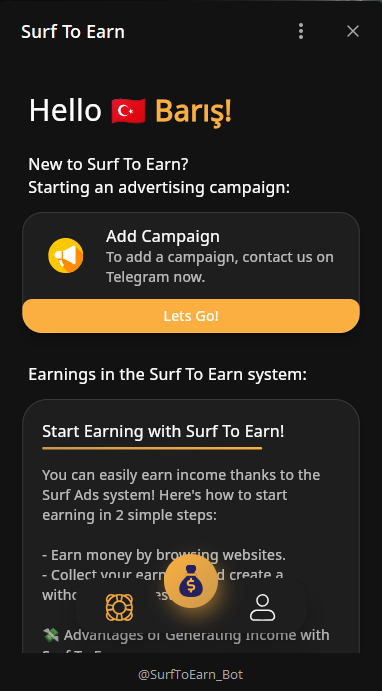
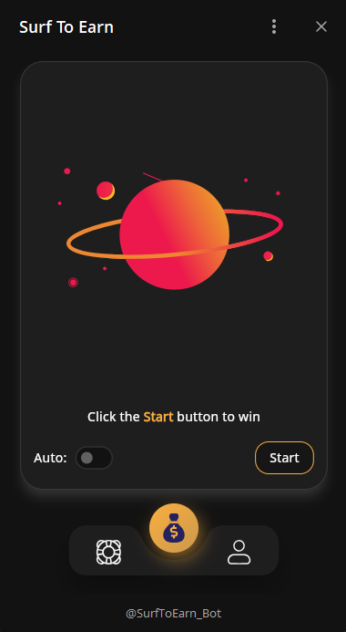
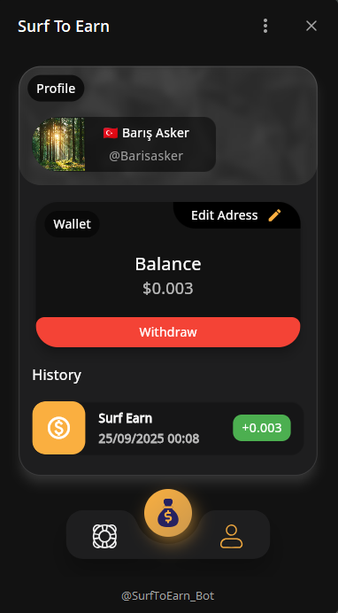
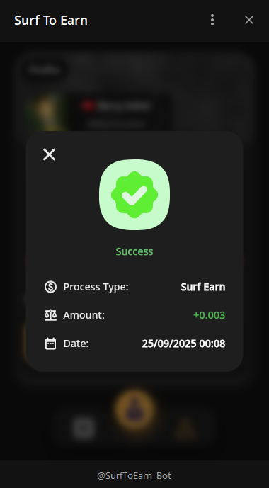

# Surf To Earn: Earn Rewards by Surfing Ads on Telegram

**Surf To Earn** is a Telegram Mini App that allows users to earn small rewards (crypto, points, or tokens) by interacting with advertisements or browsing websites. With an easy-to-use interface built into Telegram, users can passively earn by simply engaging with content.

## How It Works

Surf To Earn enables users to generate earnings through a simple 2-step system:

1. Users click the **Start** button inside the app to begin surfing ads or websites.
2. Each view is recorded and rewarded, and earnings are added to the user’s wallet.

The system provides both manual and auto-surfing modes to enhance user flexibility.

### Key Features

- **Telegram Mini App Integration:** Seamless operation within Telegram.
- **Wallet System:** Real-time balance tracking with withdrawal options.
- **Incentivized Browsing:** Earn micro-payments for viewing promoted content.
- **Campaign Management:** Advertisers can submit ad campaigns via Telegram.
- **Manual & Auto Surf:** Users can surf at their own pace or activate auto mode.

## Visuals

Here are some screenshots of Surf To Earn in action:

  
  
  
    

## Getting Started

To get started with Surf To Earn, follow these steps:

1. Open Telegram and search for [@SurfToEarn_Bot](https://t.me/SurfToEarn_Bot)
2. Click **Start** to launch the Mini App.
3. Start surfing and earning instantly.

## Coming Soon...

- Referral system
- Crypto withdrawal integration
- Daily bonus & streak rewards
- Advertiser analytics dashboard

---

> **Note:** This application is for micro-rewards and engagement. Earnings depend on available ads and user interaction. Minimum withdrawal limits may apply.
